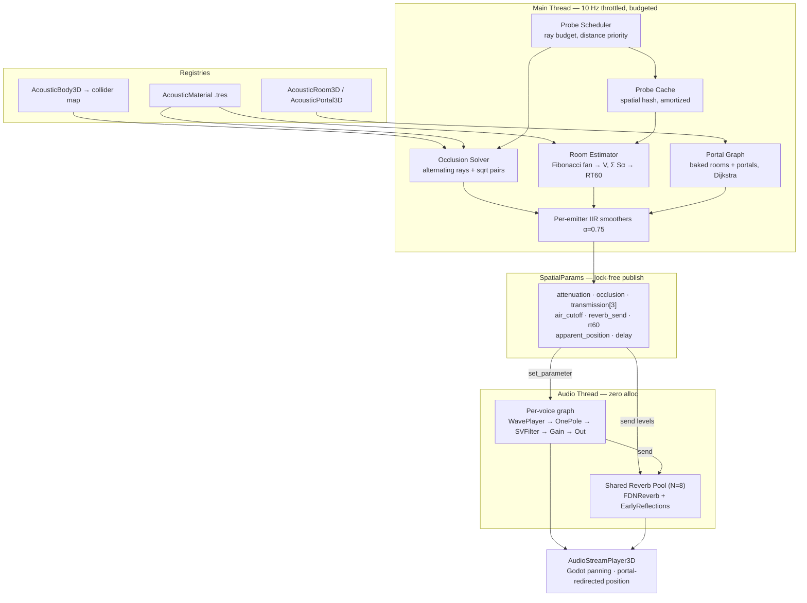

# Implementation Plan — Spatial Acoustics for Symphony

## Problem Statement

Symphony is a complete audio engine except for 3D spatial acoustics. It has no 3D playback path (`play_event` takes `Vector2` only), no occlusion, no room acoustics, no propagation. The `spatial_audio_player_3d` addon implements these features but in an architecture incompatible with Symphony: it extends `AudioStreamPlayer3D` directly, owns its own playback, creates an AudioServer bus per emitter, and bypasses voice pooling, RTPC, and event dispatch entirely.

Goal: absorb the addon's acoustic modelling as a native C++ spatial layer inside `modules/symphony/`, keeping what is physically sound, correcting what is wrong, and discarding what fights Symphony's design.

## Requirements

| # | Requirement | Source |
|---|---|---|
| R1 | Spatial engine lives in `modules/symphony/spatial/` as C++ | User decision (Q1=C) |
| R2 | Tuning data in `.tres` resources to preserve designer iteration despite C++ | Mitigation for lost hot-reload |
| R3 | Per-voice in-graph filtering for occlusion + air absorption | Q2 split architecture |
| R4 | Shared pre-allocated reverb pool — never create buses at runtime | Verified: `add_bus_effect`/`remove_bus` lock the audio driver |
| R5 | Plain-WAV `SoundEvent`s must get full spatial treatment with no authoring change | UX non-regression |
| R6 | Raycasting on main thread only; audio thread reads a parameter struct | Steam Audio pattern, `study_spatial_audio.md` §2.2 |
| R7 | Bounded per-frame ray budget regardless of emitter count | Addon has no ceiling |
| R8 | Portal propagation included | Q3=B, research sufficient |
| R9 | Zero allocation on the audio thread; arena-allocated graphs | AGENTS.md invariant |
| R10 | Cross-platform C++ (desktop, mobile, Web/WASM) | User: "most performant and portable" |

## Reference Paths

| Resource | Path |
|---|---|
| SeqLock template & future milestone notes | `/Users/luong.pham/Work/game-template/docs/audio/plan/notes_future_milestone.md` |
| Spatial audio addon (reference implementation) | `/Users/luong.pham/Work/spatial_audio_player_3d` |
| Symphony module (this repo) | `/Users/luong.pham/Work/godot/modules/symphony/` |
| Game audio layer addon | `/Users/luong.pham/Work/game-template/addons/symphony_audio/` |
| Spatial research study | Knowledge base `audio-research` |

## Background — Research Findings Applied

Verified constants and algorithms adopted from `study_spatial_audio.md`:

| Finding | Application |
|---|---|
| Occlusion IIR smoothing α = 0.75 (Resonance, production value) | Per-emitter smoother default |
| Min-frequency LPF stacking, never multiply | Combining occlusion + air absorption + zone filters |
| First check instant, no fade-in from unoccluded (UE5) | Snap params on emitter spawn |
| 10 Hz probe throttle is imperceptible (UE5 default) | Scheduler base rate |
| Alternating-ray transmission + `sqrt` for hit pairs (Steam Audio) | Corrects the addon's double-counting |
| Volumetric occlusion samples sphere *volume*, validates from source centre first | Graduated occlusion instead of binary |
| Decouple detection from filtering (Resonance) | Engine produces scalars; DSP consumes them |
| Shoebox 6-wall image source, no geometry queries (Resonance) | Early reflections |
| Angular path deviation → LPF (Steam Audio `DeviationModel`) | Diffraction without wave simulation |
| Sabine/Eyring RT60 from volume + Σ(Sᵢαᵢ) | Drives `SymphonyFDNReverb.decay_time` directly |

Reused Symphony primitives — no new DSP where existing operators suffice:

`SymphonyWavePlayer` (stream playback in-graph) · `SymphonySVFilter` / `SymphonyOnePole` (occlusion, air absorption) · `SymphonyFDNReverb` (zone reverb with real `decay_time`) · `SymphonyDelayLine` (propagation delay, reflection taps) · `SymphonyParameterSmoother` (extended with log-domain mode) · `SymphonyGraphInput` + `AudioStreamPlaybackSymphony::set_parameter` (verified param path)

## Proposed Architecture

Key structural choice: **Godot's `AudioStreamPlayer3D` still does the panning.** Pooled players each carry an `AudioStreamSymphony` stream. We supply DSP and position; Godot supplies spatialization. Portal redirection is then simply writing a different `global_position` — exactly what the research doc recommends.

## Updated Phase Table (for AGENTS.md)

Spatial moves from the deferred `G7` in `game-template` to native module phases. Old backlog `S5: Generative Music` shifts to `S7`.

| Phase | Scope | Repo | Status |
|-------|-------|------|--------|
| S1 | Core Completion — DelayLine, FeedbackPath, SVFilter, ParameterSmoother, StochasticTrigger, PolyBLEP | `modules/symphony/` | Done |
| S2 | Synthesis Toolkit — ModalBank, GrainCloud, PitchShifter, Waveshaper, FM, CrossFade | `modules/symphony/` | Done |
| S3 | Advanced Synthesis — FormantOsc, FDN Reverb, Waveguide presets, LOD graphs | `modules/symphony/` | Done |
| S4 | Spectral — PhaseVocoder, SpectralGate, enhanced GrainCloud | `modules/symphony/` | Done |
| G1 | Foundation — SoundEvent, VoiceManager, EventDispatcher, AudioManager autoload | both | Done |
| G2 | Music System — MusicStateGraph, BeatClock, layer control | both | Done |
| G3 | RTPC Integration — parameter smoothing, curve evaluation | both | Done |
| G4 | Dialogue & Bus — DialogueAudioPipeline, BusController snapshots, auto-ducking | both | Done |
| G5 | Ambient & Spatial 2D — AudioZone2D, scatter layers, distance attenuation | `game-template/` | Done |
| G6 | Profiling & Debug — performance monitors, debug overlay | `game-template/` | Done |
| **S5** | **Spatial Acoustics Core** — 3D playback, AcousticMaterial, occlusion, air absorption, RT60 reverb pool, propagation delay, probe scheduler | `modules/symphony/` | **Planned** |
| **S6** | **Portal Propagation & Reflections** — room/portal graph, portal routing, diffraction EQ, shoebox early reflections | `modules/symphony/` | **Planned** |
| **G7** | **Spatial Authoring & Debug** — AudioZone3D ambient integration, spatial debug overlay | `game-template/` | **Planned** |
| S7 | Generative Music — note-based systems, scale-aware generation | `modules/symphony/` | Backlog |
| G8 | Platform Tuning — adaptive buffer sizing, ADPF, web latency | both | Backlog |
| G9 | Audio LOD — distance tiers, graph complexity reduction | both | Backlog |
| G10 | Advanced Ambient — influence maps, voxel emitters, time-of-day | `game-template/` | Backlog |

## Explicitly Skipped

Per your instruction — anything that fights the architecture or bloats without payoff:

| Skipped | Reason |
|---|---|
| `SpatialReflectionNavigationAgent3D` (~68 KB) | Runtime A* over random sphere samples. Non-deterministic, expensive, author-labelled "HIGHLY EXPERIMENTAL". S6 portal graph solves the same problem authorably and far cheaper. |
| Per-emitter AudioServer bus | Verified 3 audio-driver locks per emitter lifecycle. Replaced by pre-allocated pool. |
| `RayCast3D` child nodes (up to 33/emitter) | Scene-tree bloat, transform propagation cost. Replaced by direct space state queries. |
| Duplicate distance attenuation | `SymphonyVoicePool` already owns attenuation. Extend it, don't shadow it. |
| Per-emitter `_physics_process` | Replaced by one centralized budgeted scheduler. |
| Addon's `absorption_wetness_influence` / `absorption_damping_influence` magic knobs | Superseded by physically-derived RT60. |
| Addon's debug overlay UI (~30 KB of RichTextLabel/panel code) | You already have a debug overlay. Take the diagnostic *data points* only. |
| Addon's `SHAPE_SCATTER` ray distribution | Redundant with Fibonacci + probe cache. |
| HRTF / binaural | Genuinely out of scope. Setup notes below. |

## Deferred, With Setup Notes

Not in this plan, but the plan leaves the hooks in place:

- **Baked probe-path propagation** (Steam Audio `ProbeBatch` style). S6's portal graph covers the same need for authored spaces. If you later want it for open/organic geometry: the `SpatialAcousticsEngine` path-solve interface in Task 15 must stay virtual so a baked-probe backend can substitute for the portal backend, and you'll need an offline bake step writing a `ProbeVisibilityGraph` resource plus an `EditorImportPlugin` to trigger it.
- **Geometric diffraction** (true edge-finding). S6 Task 15 ships the `DeviationModel` approximation (angular deviation → LPF), which covers most perceptual value. True diffraction needs edge extraction from collision meshes — requires a mesh-preprocessing pass storing silhouette edges per `AcousticBody3D`.
- **HRTF / binaural**. Needs an HRIR dataset (CIPIC or MIT KEMAR), partitioned convolution, and per-ear delay. Your micro-block + arena architecture suits it, but it requires a new `SymphonyConvolver` operator with FFT partitioning and a licensed dataset. Prerequisite: Task 7's graph must keep a stereo-capable output path rather than assuming mono-then-Godot-pan.
- **GPU reverb offload**. `GPU_DSP_BACKEND_v2.md` already flags FDN reverb as a candidate. Task 10's reverb pool should expose its per-instance parameter block as a contiguous struct so a GPU backend can consume it without refactoring.

---

## Task Breakdown

### Phase S5 — Spatial Acoustics Core

**Task 1: Establish the 3D playback path**

Objective: make a `SoundEvent` audible at a `Vector3` through Symphony's voice pool.

Add a pooled `AudioStreamPlayer3D` set in `AudioManager` alongside the existing 2D pool. Add `play_event_3d(event, position: Vector3, params)` mirroring `play_event`. Add `SoundEventPlayer3D extends Node3D` in the addon. Set `SymphonyVoicePool::set_slot_position` with the true `Vector3` (2D path currently zero-fills Z). Disable Godot's built-in attenuation as the 2D path does, since `VoicePool` owns it.

Tests: pool acquire/release under exhaustion; `play_event_3d` returns valid slot and registers position; `spatial_mode == SPATIAL_3D` routes to the 3D pool; stolen slots detach cleanly.

Demo: place three `SoundEventPlayer3D` nodes around the listener, hear correct panning and distance falloff, voice count visible in the existing debug overlay.

---

**Task 2: Extend attenuation curves**

Objective: add the addon's useful falloff shapes to Symphony's attenuation model.

Extend `SoundEvent::AttenuationModel` with `ATTENUATION_NATURAL` (`pow(1-α, 1.5)`), `ATTENUATION_LOG_REVERSE`, and `ATTENUATION_INVERSE_SQUARE`. Implement in `SymphonyVoicePool`'s attenuation computation. Add `inner_radius` / `falloff_distance` to `SoundEvent` so the inner full-volume zone from the addon is expressible. Interpolate in linear amplitude, not dB, as the addon correctly does.

Tests: each curve returns 1.0 at inner radius and 0.0 at outer; monotonic decreasing; custom `Curve` path still works; inner radius yields unattenuated output.

Demo: same SFX with each curve, walking the same path — audibly different falloff character.

---

**Task 3: `AcousticMaterial` resource**

Objective: port the addon's material model, aligned to Steam Audio's band layout.

Create `spatial/acoustic_material.h/.cpp` as a `Resource`: `absorption_low/mid/high`, `scattering`, `transmission_low/mid/high`, `total_absorption`, `total_absorption_transition_speed`. Ship the 12 presets as `.tres` files under `spatial/presets/` (R2 — data, not compiled constants) plus static constructors. Write `doc_classes/AcousticMaterial.xml`.

Tests: all 12 presets load and round-trip through `.tres`; coefficients clamp to [0,1]; `acoustic_foam` reports `total_absorption`; default-constructed material equals the `generic` preset.

Demo: material presets appear in the inspector with named coefficients; a `.tres` edit is picked up on reload without recompiling.

---

**Task 4: `AcousticBody3D` and collider registry**

Objective: resolve a physics collider to its acoustic material in O(1).

Create `AcousticBody3D : Node3D` holding an `AcousticMaterial` reference, registering itself in a `HashMap<ObjectID, AcousticMaterial*>` on `_enter_tree` and deregistering on `_exit_tree`. Replace the addon's `find_for_collider` tree-walk with the map. Add an editor plugin button on `CollisionShape3D` / `CSGShape3D` selection to attach one (the one addon UX affordance worth keeping).

Tests: registry returns the material for a registered collider and null otherwise; deregistration on free leaves no dangling entry; nested colliders resolve to the nearest ancestor body; lookup is allocation-free.

Demo: tag walls in a test scene with concrete/carpet/glass; a debug print on a raycast hit reports the correct material name.

---

**Task 5: `SpatialParams` and engine skeleton**

Objective: stand up the simulation→parameters→DSP boundary with smoothing, before any geometry work.

Create `spatial/spatial_acoustics_engine.h/.cpp` as an `Object` singleton. Define a POD `SpatialParams { float attenuation, occlusion, transmission[3], air_cutoff, reverb_send, rt60, delay_s; Vector3 apparent_position; }`. Hold emitters in struct-of-arrays. Implement per-emitter first-order IIR smoothing with α default 0.75, plus "snap on first update" (UE5 pattern). Publish via a `SymphonySeqLock<SpatialParams>` using the template already drafted in `notes_future_milestone.md` — this is that document's use case C.

Tests: registering/unregistering emitters; smoother converges to target within tolerance over N updates; first update snaps rather than ramps; publish/read round-trips under concurrent reader access; no allocation in the update path.

Demo: drive `occlusion` from 0→1 by script; log shows a smooth ~100 ms curve, not a step. No audio yet — this is the plumbing, verified in isolation.

---

**Task 6: Occlusion solver with material transmission**

Objective: compute occlusion and 3-band transmission correctly.

Implement the direct-path query using `PhysicsServer3D::space_get_direct_state()->intersect_ray()` — no `RayCast3D` nodes. Implement Steam Audio's algorithm: alternate ray direction between listener→source and source→listener, accumulate `transmission[band] *= material.transmission[band]` per hit, and **take `sqrt` of the accumulated product when hit count > 1** to avoid double-counting wall entry/exit faces. Terminate on no-hit, distance exceeded, or ray budget exhausted. Honour `total_absorption` as a hard mute with its own transition speed. Exclude the listener's own `CharacterBody3D`.

Tests: unoccluded path gives transmission 1.0 across bands; single thin wall matches its material coefficients; two-hit solid wall yields `sqrt` of the product, not the raw product (explicit regression test for the addon's bug); `total_absorption` mutes; listener body excluded; ray count never exceeds `max_occlusion_hits`.

Demo: walk behind a concrete wall vs a glass pane vs acoustic foam — three audibly distinct results, with low frequencies leaking more than highs.

---

**Task 7: In-graph occlusion and air absorption**

Objective: apply the computed scalars as DSP, with plain WAVs working unchanged.

Implement auto-generation of a spatial wrapper graph for `SoundEvent`s carrying raw `AudioStream`s (R5): `SymphonyWavePlayer → SymphonyOnePole (air) → SymphonySVFilter (occlusion) → gain → SymphonyGraphOutput`, with `SymphonyGraphInput` nodes for each parameter. Feed values through `AudioStreamPlaybackSymphony::set_parameter` (path verified). Combine cutoffs by **minimum frequency, never multiplication**. Add a log-domain interpolation mode to `SymphonyParameterSmoother` and use it for all cutoff sweeps. Implement distance→cutoff air absorption with linear and log frequency scaling.

Tests: wrapper graph compiles within arena budget; per-voice arena footprint stays under target; min-frequency stacking verified against multiplication; log sweep is perceptually even (equal ratios per unit time); a graph-authored `SoundEvent` bypasses the wrapper and uses its own graph; zero allocation during playback.

Demo: A/B toggle spatial effects on a plain WAV footstep — muffling behind walls and long-distance HF rolloff, with no `.tres` authoring change.

---

**Task 8: Probe scheduler and cache**

Objective: make cost independent of emitter count (R7).

Implement a centralized scheduler with a configurable per-frame ray budget, round-robin across emitters, prioritized by listener distance and current audibility. Base rate 10 Hz. Add a spatial-hash probe cache so emitters in the same cell reuse a room-acoustics sample instead of each firing a fan, with time-based invalidation. Emit metrics (rays issued, cache hit rate, emitters serviced) as Godot custom performance monitors alongside the existing G6 ones.

Tests: total rays per frame never exceeds budget with 200 emitters; nearer emitters update more often than distant ones; cache hit rate exceeds threshold for clustered emitters; invalidation triggers on geometry change; inaudible emitters are skipped.

Demo: scene with 100+ emitters holding stable frame time; Performance tab shows ray budget respected and cache hit rate. Contrast with the addon's unbounded 1600 rays/frame at the same emitter count.

---

**Task 9: Room estimation and physical RT60**

Objective: derive reverb parameters from geometry and materials rather than tuning knobs.

Implement the Fibonacci-sphere ray fan (port the golden-angle generator — it's correct) with optional bounces. Estimate room volume from ray distances and accumulate absorption-weighted surface contributions. Compute RT60 via Sabine with Eyring correction for highly absorptive rooms:

$$RT_{60} \approx \frac{0.161\,V}{\sum_i S_i \alpha_i}$$

Support `ignore_floor` with an angle threshold (the addon's reasoning is sound — the floor is always present and skews room size). Track openness as the escaped-ray ratio.

Tests: sealed 10 m cube of concrete yields RT60 in the expected range; the same cube in acoustic foam yields a much shorter RT60; open sky yields near-zero reverb; `ignore_floor` changes volume estimate as expected; Eyring path engages above the absorption threshold; estimates are stable frame to frame within tolerance.

Demo: on-screen RT60 readout while walking from a carpeted corridor into a concrete hall — the number tracks the space, replacing the addon's two hand-tuned influence multipliers.

---

**Task 10: Shared reverb pool**

Objective: expensive reverb, correctly shared, zero runtime bus churn (R4).

Pre-allocate N (default 8) `SymphonyFDNReverb` instances at init. Cluster emitters by acoustic similarity (room membership once S6 lands, RT60/room-size proximity before that) and assign each cluster a pool slot. Drive `decay_time` from Task 9's RT60 and `damping` from mean high-band absorption. Implement per-voice send levels feeding the shared instance. Crossfade pool assignment when an emitter migrates. Expose the per-instance parameter block as a contiguous struct for future GPU offload.

Tests: pool never allocates after init; no `AudioServer.add_bus_effect` or `remove_bus` calls at runtime (assert this explicitly — it's the addon's core flaw); emitters in one room share an instance; migration crossfades without click; exceeding N clusters degrades gracefully to nearest match; memory stays near the ~1 MB target rather than per-voice ~6.3 MB.

Demo: 20 emitters across three rooms; profiler shows 3 active reverb instances, not 20. Walking between rooms crossfades the tail smoothly.

---

**Task 11: Propagation delay**

Objective: distant one-shots arrive late.

Add `speed_of_sound` and `enable_propagation_delay` to `SoundEvent`. For one-shots, compute `distance / speed_of_sound` and defer voice start; skip below a ~10 ms threshold. Implement as deferred start in the dispatcher rather than the addon's `SceneTreeTimer` (avoids a per-play object allocation). Guard against stacking with the existing cooldown logic.

Tests: delay matches distance/speed within tolerance; sub-threshold distances start immediately; cancelling a pending play does not leak a slot; looping events ignore the setting; interaction with cooldown is correct.

Demo: explosion 340 m away — visible flash, audible report ~1 s later.

---

**Task 12: Volumetric occlusion**

Objective: graduated rather than binary occlusion.

Implement Steam Audio's `volumetricOcclusion`: sample points within the source's `radius` **volume**, validate each is visible from the source centre first, then test visibility to the listener, and take the visible fraction as the occlusion scalar. Add `source_radius` to `SoundEvent`. Sample count scales with emitter priority and remaining ray budget from Task 8.

Tests: fully open source reports 0.0 occlusion; fully blocked reports 1.0; a source half behind an edge reports near 0.5; samples validated against the source centre (a sample inside geometry is rejected); respects the scheduler budget.

Demo: walk slowly past a doorway — smooth occlusion sweep instead of the addon's binary snap at the wall edge.

---

### Phase S6 — Portal Propagation & Reflections

**Task 13: Room and portal authoring nodes**

Objective: let designers describe space topology.

Create `AcousticRoom3D : Area3D` (room bounds, assigned material set, optional authored shoebox dimensions, reverb preset override) and `AcousticPortal3D : Node3D` (aperture rectangle, the two rooms it connects, open/closed state, transmission override). Implement listener and emitter room membership with caching. Write `EditorNode3DGizmoPlugin` implementations for both — the correct replacement for the addon's `ImmediateMesh`-in-`_physics_process` hack.

Tests: point-in-room queries correct for overlapping rooms with priority; membership caching invalidates on movement; portal correctly reports its two rooms; a closed portal reports blocked; gizmos render without affecting runtime cost.

Demo: author a two-room-plus-doorway scene; overlay reports which room the listener and each emitter occupy.

---

**Task 14: Portal graph bake and path solve**

Objective: find how sound travels between rooms.

Build a graph with rooms as nodes and portals as weighted edges, baked to a resource on scene save (with a runtime rebuild fallback). Implement Dijkstra over it. Cache solved paths per emitter-room/listener-room pair, invalidated on portal state change. Keep the solve behind a virtual interface so a baked-probe backend can substitute later (see deferred notes).

Tests: same-room emitters short-circuit with no path solve; adjacent rooms find the single-hop path; three-room chain finds two hops; closing a portal reroutes or reports unreachable; cached paths invalidate on state change; solve cost bounded for a 50-room graph.

Demo: debug draw showing the solved path from an emitter two rooms away, rerouting live when a door closes.

---

**Task 15: Portal routing and diffraction**

Objective: make around-corner sound come from the doorway, filtered by how far it bent.

Redirect `apparent_position` to the last portal on the path so Godot's panner points at the opening. Accumulate per-hop attenuation from portal aperture area and incidence angle. Implement Steam Audio's `DeviationModel`: total angular deviation along the path maps to LPF strength, approximating diffraction. Couple neighbouring-room reverb through open portals by blending Task 10 send levels.

Tests: same-room emitters keep their true position; a one-hop emitter's apparent position sits at the portal; 90° deviation attenuates highs more than a straight path; larger apertures pass more energy; closed portals fall back to transmission-only; reverb blends across an open portal.

Demo: sound source in an adjacent room — audibly arrives *through the doorway*, from the doorway's direction, dulling as you move off-axis. This is the behaviour the skipped nav agent was reaching for, at a fraction of the cost.

---

**Task 16: Shoebox early reflections**

Objective: convey room size before the reverb tail, with no geometry queries.

Add a `SymphonyEarlyReflections` operator: a multi-tap delay computing 6 image sources from room dimensions (Resonance `ComputeReflections`). Per wall: reflected listener position → tap delay `distance / speed_of_sound`, gain from that wall's reflection coefficient. Source dimensions from `AcousticRoom3D` authored values, falling back to Task 9's estimate. One shared instance per reverb pool slot, feeding the same send.

Tests: 6 taps generated for a closed room; delays match distance/speed within a sample; gains track material reflection coefficients; a large room produces later, quieter reflections than a small one; arena-allocated with no runtime allocation; falls back cleanly when dimensions are unauthored.

Demo: identical impulse in a small tiled bathroom vs a large hall — room size is obvious from the reflection pattern alone, before any late tail.

---

### Phase G7 — Game Layer Integration

**Task 17: 3D ambient zones**

Objective: bring the G5 ambient system into 3D.

Add `AudioZone3D` in the addon mirroring `AudioZone2D`'s influence/priority/scatter model, using `AcousticRoom3D` for membership. Generalize `AmbientSystem` to handle both 2D and 3D zones through a shared influence interface rather than forking the logic. Scatter placement uses 3D positions within room bounds.

Tests: 3D zone influence falls off correctly outside bounds; crossfade between adjacent 3D zones is smooth; `max_simultaneous_zones` and the eviction hysteresis still hold; 2D zones behave identically to before (regression); scatter events land inside room bounds.

Demo: walk a forest→cave→hall path in 3D; ambience crossfades and scatter one-shots place around you in three dimensions.

---

**Task 18: Spatial debug and diagnostics**

Objective: make the system observable, reusing existing infrastructure.

Extend the G6 debug overlay with a spatial panel: per-emitter distance, occlusion, transmission bands, resolved material names, RT60, reverb pool assignment, portal path. Read via the Task 5 SeqLock so many readers cost nothing on the audio side. Add a global effects on/off toggle for A/B comparison (the addon's most useful debug affordance). Add runtime ray visualization through the Task 13 gizmo infrastructure. Publish scheduler metrics to the Performance tab.

Tests: overlay reads without tearing under concurrent updates; toggle disables all spatial processing and restores it; overlay adds no cost when hidden; metrics match engine-internal counters.

Demo: full-scene walkthrough with live diagnostics, F-key A/B toggle, and ray visualization — matching the addon's debug value while reusing your overlay rather than adding a second one.

---

## Verification Strategy

Per-task unit tests as listed, plus:

- **Arena budget assertions** — every new operator's allocation verified against `SymphonyMemoryBudget`.
- **Realtime-safety assertions** — `SymphonyRealtimeScope` guards on all audio-thread paths (Tasks 7, 10, 16).
- **Explicit anti-regression test** — assert zero `AudioServer::add_bus_effect` / `remove_bus` calls after init, since that's the addon's defining flaw.
- **Scaling benchmark** — frame time and ray count at 10 / 50 / 100 / 200 emitters, tracked across tasks so regressions surface early.
- **GdUnit4 integration tests** in `game-template` for Tasks 1, 17, 18.

Cross-platform builds (desktop, mobile, Web/WASM) verified at S5 and S6 completion, since R10 is a stated goal and the FDN pool's memory footprint matters most on mobile and Web.
